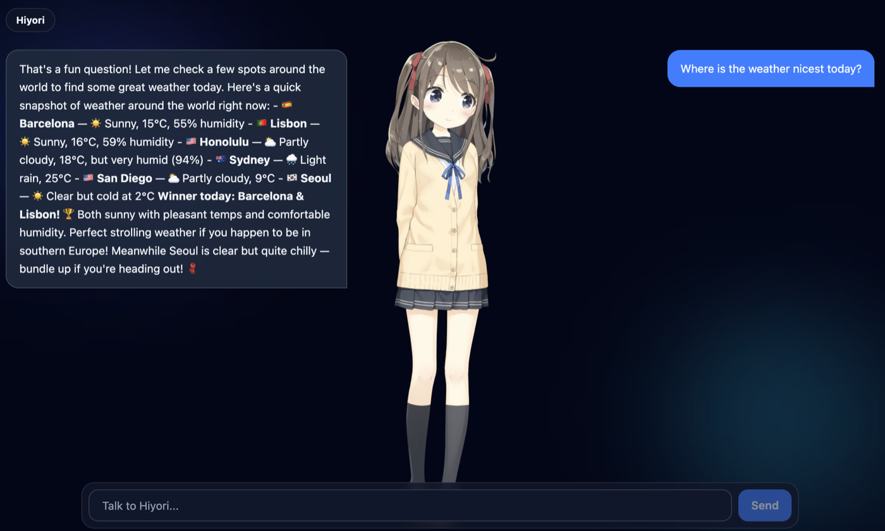

# LiveClaw

[](https://github.com/zeikar/liveclaw/actions/workflows/ci.yml)
[](https://github.com/zeikar/liveclaw/releases/latest)

OpenClaw-powered desktop AI companion with Live2D avatars, voice input, and speech synthesis.

> **Work in progress** - actively under development. Contributions and feedback are welcome.

Built with **Electron + React + TypeScript** and the [Charivo](https://github.com/zeikar/charivo) framework.

## Download

Prebuilt installers for each release are on the [latest release page](https://github.com/zeikar/liveclaw/releases/latest):

- **macOS** (Apple Silicon) - `.dmg`
- **Windows** - `-setup.exe`
- **Linux** - `.AppImage`, `.deb`

> macOS builds are ad-hoc signed (not notarized), so Gatekeeper blocks them on first launch.
> Open the app once via **right-click → Open**, or clear the quarantine flag:
>
> ```bash
> xattr -dr com.apple.quarantine /Applications/liveclaw.app
> ```

## Screenshot



## Tech Stack

- **Electron** - Desktop app shell
- **React + TypeScript** - Renderer UI
- **electron-vite** - Build tooling
- **Live2D** (`@charivo/render-live2d`, `@charivo/render`) - Character model rendering and motion playback
- **Charivo** (`@charivo/core`, `@charivo/llm`, `@charivo/tts`) - Character session orchestration (LLM/TTS/Renderer)
- **[OpenClaw](https://openclaw.ai/)** (`@charivo/server/openclaw`) - Local LLM backend for chat
- **OpenAI TTS** (`@charivo/tts/openai`) - Direct renderer-side speech synthesis for local use

## Architecture

```txt
[Renderer - React]
  useCharivo + Live2DPanel/useLive2DRenderer
       |
       | Charivo events
       v
[Renderer - Live2D]
  @charivo/render-live2d
       |
       | IPC (window.api.chat)
       v
[Main Process - Node.js]
  @charivo/server/openclaw
       |
       | HTTP (OpenAI-compatible)
       v
[OpenClaw - localhost:18789]
```

```txt
[Renderer - React]
  @charivo/tts/openai
       |
       | HTTPS
       v
[OpenAI Audio API]
```

OpenClaw API calls are handled in the Electron **main process (Node.js)** to avoid renderer CORS/PNA limits.
TTS is intentionally direct from the renderer for local development convenience.

## Live2D Integration

Live2D is already integrated through Charivo renderer attachment.

- Live2D renderer hook: `src/renderer/src/hooks/useLive2DRenderer.ts`
- Live2D panel component: `src/renderer/src/components/Live2DPanel.tsx`
- Model path config: `src/renderer/src/config/live2d.ts`

`charivo.attachRenderer(manager)` and `charivo.setCharacter(APP_CHARACTER)` are already wired in the renderer lifecycle.

## Prerequisites

- [OpenClaw](https://openclaw.ai/) installed and running (default: `http://127.0.0.1:18789`)
- OpenAI API key for TTS
- Node.js and npm

## Configuration

### 1. OpenClaw chat provider

OpenClaw's OpenAI-compatible HTTP API is **disabled by default**. Enable it on the gateway first,
otherwise every chat request fails:

```bash
openclaw config set gateway.http.endpoints.chatCompletions.enabled true
openclaw gateway restart
```

Verify the gateway before running the app:

```bash
curl http://127.0.0.1:18789/v1/models \
  -H "Authorization: Bearer $(openclaw config get gateway.auth.token)"
```

If OpenClaw is installed and its gateway is reachable, **there is nothing else to configure.**
LiveClaw reads `gateway.auth.token` and `gateway.port` straight out of `~/.openclaw/openclaw.json`
(or `$OPENCLAW_CONFIG_PATH`) at runtime, checks them with `GET /v1/models`, and starts chatting. No
token pasting. An auto-detected token is **never written to LiveClaw's own config**, so rotating it
inside OpenClaw is picked up automatically the next time LiveClaw launches. The app also reads the
`gateway.http.endpoints.chatCompletions.enabled` flag from that same file (absent means disabled)
and shows the fix above in-app if it looks off.

If auto-detection doesn't apply — `gateway.auth.mode` is `password`, the token is a secretRef or a
`${OPENCLAW_GATEWAY_TOKEN}`-style interpolation, the config file isn't readable, or the detected local
gateway isn't the one you want to reach (the `GET /v1/models` check catches that mismatch) — the setup
screen asks for a token and base URL instead. A **manually entered** token _is_
stored, together with its base URL, in LiveClaw's own `config.json`, and takes precedence over
auto-detection. Switching that section back to "auto-detected" removes the stored override (which may
leave the app unconfigured again if auto-detection still doesn't apply — that just brings the setup
screen back).

Put together, the precedence per field is: LiveClaw `config.json` (manual override) → an explicitly-set
dev `OPENCLAW_BASE_URL` (`.env`, development only) → OpenClaw auto-detect → the loopback default —
auto-detection is a guess (it can't see a CLI `--port` or `OPENCLAW_GATEWAY_PORT` override), so an
explicit dev override corrects it rather than the other way around. One rule applies throughout: any
token LiveClaw holds implicitly — auto-detected, read from `.env`, or saved earlier — is only ever
sent to the gateway it was configured for. Point LiveClaw at a different host and it asks for that
host's token; it never reuses one across origins.

Chat runs on one OpenClaw session per conversation, and **New chat** starts a fresh one. See
[docs/openclaw-integration.md](docs/openclaw-integration.md) for how the gateway behaves and why the
client is built around it.

### 2. Where settings live

LiveClaw stores its own settings in `config.json` under `app.getPath('userData')`:

- macOS: `~/Library/Application Support/liveclaw/`
- Windows: `%APPDATA%\liveclaw\`
- Linux: `~/.config/liveclaw/`

That file holds the OpenAI API key, the TTS model/voice, and any manually entered OpenClaw override
(token + base URL). It's plaintext, written `0600` on macOS/Linux; on Windows it inherits the
per-user ACL of `%APPDATA%` (Node's `chmod` there only toggles the read-only bit, it doesn't restrict
other accounts).

Blank secret fields in the settings form keep the stored value. **"Remove key" deletes the stored
OpenAI key** — a key supplied through `.env` in development is disabled by editing `.env`, since the
app cannot remove what it does not store. Deleting `config.json` resets everything back to
auto-detected/`.env` defaults.

### 3. Direct OpenAI TTS

Set your OpenAI API key from the in-app settings screen, or via `.env` in development (see below).

Supported models: `tts-1`, `tts-1-hd`, `gpt-4o-mini-tts`

Supported voices: `alloy`, `echo`, `fable`, `marin`, `onyx`, `nova`, `shimmer`

If no OpenAI key is configured, TTS is disabled and chat still works.

### 4. Character profile

Character profile can be changed in `src/renderer/src/config/character.ts`.

### 5. `.env` (development fallback only)

`.env` is a fallback consulted per field, and only for fields both `config.json` and OpenClaw
auto-detection leave empty — except an explicitly-set `OPENCLAW_BASE_URL`, which overrides a
successful auto-detection too, since auto-detection is a guess a CLI `--port` can invalidate. It only
applies when the app is **not packaged** (`app.isPackaged === false`); that check, not
`electron-builder.yml`'s `.env` exclusion, is what makes it dev-only. The exclusion stays in the
packaging config regardless — keeping secrets out of a built app is still the right call.

```bash
# OpenClaw — rarely needed now that the token is auto-detected; only useful for a dev gateway
# auto-detection can't see (a non-default OPENCLAW_CONFIG_PATH, a CLI --port, etc.)
OPENCLAW_TOKEN=your_openclaw_token
OPENCLAW_BASE_URL=http://127.0.0.1:18789/v1

# Direct OpenAI TTS
OPENAI_API_KEY=your_openai_api_key
OPENAI_TTS_MODEL=gpt-4o-mini-tts
OPENAI_TTS_VOICE=marin
```

`LIVECLAW_USER_DATA_DIR` (dev-only) points `app.getPath('userData')` at a throwaway profile
directory, useful for testing setup/auto-detection without touching your real `config.json`.

## Security Note

Direct renderer-side OpenAI usage exposes the API key to the local client runtime. Use this setup
only for trusted local/dev environments.

The OpenClaw gateway token is an **operator-grade credential**, not a scoped API key — keep it local.
An auto-detected token is never duplicated onto disk; a token you type into the setup screen is
stored in `config.json` as described above.

## Roadmap

- [x] OpenClaw LLM integration via IPC
- [x] Chat UI (message history, error handling)
- [x] Live2D rendering integration (`@charivo/render-live2d`)
- [x] Direct OpenAI TTS integration (`@charivo/tts/openai`)
- [ ] Speech-to-text (`@charivo/stt`)
- [ ] WebSocket support for real-time streaming responses

## Recommended IDE Setup

- [VSCode](https://code.visualstudio.com/) + [ESLint](https://marketplace.visualstudio.com/items?itemName=dbaeumer.vscode-eslint) + [Prettier](https://marketplace.visualstudio.com/items?itemName=esbenp.prettier-vscode)

## Project Setup

### Install

```bash
$ npm install
```

### Development

```bash
$ npm run dev
```

### Type Check

```bash
$ npm run typecheck
```

### Test

```bash
$ npm test
```

### Build

```bash
# For Windows
$ npm run build:win

# For macOS
$ npm run build:mac

# For Linux
$ npm run build:linux
```
