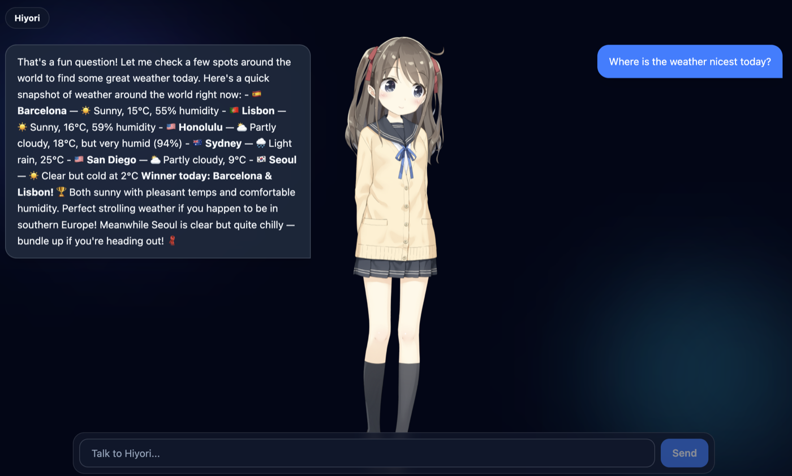

<h1 align="center">LiveClaw</h1>

<p align="center"><b>Your OpenClaw agent, with a face and a voice.</b></p>

<p align="center">
  LiveClaw puts a Live2D character on your desktop and wires it to the OpenClaw gateway you<br>
  already run. Talk to it out loud and it talks back — your agent, on your machine, no key pasting.
</p>

<p align="center">
  <a href="https://github.com/zeikar/liveclaw/actions/workflows/ci.yml"></a>
  <a href="https://github.com/zeikar/liveclaw/releases/latest"></a>
  <a href="LICENSE"></a>
</p>

<!-- Swap this screenshot for docs/images/demo.gif once the demo recording exists. -->

<p align="center">
  
</p>

## Quick start

**1. Enable OpenClaw's chat endpoint.** It is off by default, and every chat fails without it:

```bash
openclaw config set gateway.http.endpoints.chatCompletions.enabled true
openclaw gateway restart
```

**2. Install LiveClaw** from the [latest release](https://github.com/zeikar/liveclaw/releases/latest):

| Platform              | File                |
| --------------------- | ------------------- |
| macOS (Apple Silicon) | `.dmg`              |
| Windows               | `-setup.exe`        |
| Linux                 | `.AppImage`, `.deb` |

**3. Launch it.** LiveClaw reads the gateway port and token straight out of your own
`~/.openclaw/openclaw.json` and starts chatting. There is nothing to paste.

Voice is optional: add an OpenAI API key in settings to turn on speech and the mic button. Chat works
without one. If auto-detection can't apply to your setup, the app asks for a token on the setup
screen — see [Configuration](#configuration) for the details.

> **macOS:** builds are ad-hoc signed (not notarized), so Gatekeeper blocks the first launch.
> Open it once via **right-click → Open**, or clear the quarantine flag:
>
> ```bash
> xattr -dr com.apple.quarantine /Applications/liveclaw.app
> ```

## What you get

- **A character that answers you out loud.** Replies are spoken through OpenAI TTS with realtime lip
  sync, and the model tracks your cursor as you move it.
- **Voice in, voice out.** Press the mic and your speech streams into the composer live as you talk.
  Sending stays manual — nothing leaves the app on its own.
- **Your agent, not a hosted one.** Chat runs through your local OpenClaw gateway, so it keeps the
  tools and the long-term memory your agent already has.
- **Nothing to configure.** The gateway token is auto-detected and never copied into LiveClaw's own
  config, so rotating it in OpenClaw just works.
- **Your own character.** Point it at a different Live2D model and rewrite the persona in
  `src/renderer/src/config/` (requires a rebuild).

Built with **Electron + React + TypeScript** and the
[Charivo](https://github.com/zeikar/charivo) framework. Contributions and feedback are welcome.

## Tech Stack

- **Electron** - Desktop app shell
- **React + TypeScript** - Renderer UI
- **electron-vite** - Build tooling
- **Live2D** (`@charivo/render-live2d`, `@charivo/render`) - Character model rendering and motion playback
- **Charivo** (`@charivo/core`, `@charivo/llm`, `@charivo/tts`, `@charivo/stt`) - Character session orchestration (LLM/TTS/STT/Renderer)
- **[OpenClaw](https://openclaw.ai/)** (`@charivo/server/openclaw`) - Local LLM backend for chat
- **OpenAI TTS** (`@charivo/tts/openai`) - Direct renderer-side speech synthesis for local use
- **OpenAI STT** (`@charivo/stt/openai-realtime`) - Realtime voice input: WebRTC audio streaming from the renderer, bootstrapped (ephemeral secret + SDP exchange) via the main process

## Architecture

<details>
<summary><b>Three paths: chat over IPC, TTS from the renderer, voice input split across both</b></summary>

```txt
[Renderer - React]
  useCharivo + Live2DPanel/useLive2DRenderer
       |
       | Charivo events
       v
[Renderer - Live2D]
  @charivo/render-live2d
       |
       | IPC (window.api.chat)
       v
[Main Process - Node.js]
  @charivo/server/openclaw
       |
       | HTTP (OpenAI-compatible)
       v
[OpenClaw - localhost:18789]
```

```txt
[Renderer - React]
  @charivo/tts/openai (speech synthesis)
       |
       | HTTPS
       v
[OpenAI Audio API]
```

```txt
[Renderer - React]
  @charivo/stt/openai-realtime (voice input)
       |                                |
       | IPC                            | WebRTC
       | (bootstrapRealtimeSTT)         | (audio + live transcript)
       v                                |
[Main Process - Node.js]                |
  stt:bootstrapRealtime                 |
  (mint ephemeral secret,               |
   then exchange SDP)                   |
       |                                |
       | HTTPS                          |
       v                                v
[OpenAI Realtime API]
```

OpenClaw API calls are handled in the Electron **main process (Node.js)** to avoid renderer CORS/PNA limits.
TTS is intentionally direct from the renderer for local development convenience. Voice input (STT)
also opens its WebRTC session — audio and live transcript — directly from the renderer, using the SDP
answer main hands back; but the bootstrap that produces that answer, minting an ephemeral secret and
exchanging the SDP offer, runs in the main process behind an authenticated IPC call.

</details>

## Live2D Integration

Live2D is already integrated through Charivo renderer attachment.

- Live2D renderer hook: `src/renderer/src/hooks/useLive2DRenderer.ts`
- Live2D panel component: `src/renderer/src/components/Live2DPanel.tsx`
- Model path config: `src/renderer/src/config/live2d.ts`

`charivo.attachRenderer(manager)` and `charivo.setCharacter(APP_CHARACTER)` are already wired in the renderer lifecycle.

## Prerequisites

- [OpenClaw](https://openclaw.ai/) installed and running (default: `http://127.0.0.1:18789`)
- OpenAI API key — optional; required only for TTS and voice input (STT)
- Node.js and npm — only to build from source; the prebuilt installers need neither

## Configuration

### 1. OpenClaw chat provider

OpenClaw's OpenAI-compatible HTTP API is **disabled by default**. Enable it on the gateway first,
otherwise every chat request fails:

```bash
openclaw config set gateway.http.endpoints.chatCompletions.enabled true
openclaw gateway restart
```

Verify the gateway before running the app:

```bash
curl http://127.0.0.1:18789/v1/models \
  -H "Authorization: Bearer $(jq -r '.gateway.auth.token' ~/.openclaw/openclaw.json)"
```

> Read the token from the config file, not from `openclaw config get gateway.auth.token` — that
> command redacts secrets (it prints `__OPENCLAW_REDACTED__`, with or without `--json`), so a check
> built on it always answers `401` no matter how healthy the gateway is. LiveClaw reads the same file
> this `curl` does.

If OpenClaw is installed and its gateway is reachable, **there is nothing else to configure.**
LiveClaw reads `gateway.auth.token` and `gateway.port` straight out of `~/.openclaw/openclaw.json`
at runtime, checks them with `GET /v1/models`, and starts chatting. No token pasting. An
auto-detected token is **never written to LiveClaw's own config**, so rotating it inside OpenClaw is
picked up automatically the next time LiveClaw launches. The app also reads the
`gateway.http.endpoints.chatCompletions.enabled` flag from that same file (absent means disabled)
and shows the fix above in-app if it looks off.

`$OPENCLAW_CONFIG_PATH` redirects that lookup **in development only**. A packaged build always reads
the home-directory path, resolved from your OS account rather than `$HOME`: the file it names hands
over a gateway token and the origin that token is sent to, which is the same power as the
`OPENCLAW_TOKEN` a packaged build already refuses. If your config lives elsewhere, enter the gateway
URL and token once in the app's setup screen.

If auto-detection doesn't apply — `gateway.auth.mode` is `password`, the token is a secretRef or a
`${OPENCLAW_GATEWAY_TOKEN}`-style interpolation, the config file isn't readable, or the detected local
gateway isn't the one you want to reach (the `GET /v1/models` check catches that mismatch) — the setup
screen asks for a token and base URL instead. A **manually entered** token _is_
stored, together with its base URL, in LiveClaw's own `config.json`, and takes precedence over
auto-detection. Switching that section back to "auto-detected" removes the stored override (which may
leave the app unconfigured again if auto-detection still doesn't apply — that just brings the setup
screen back).

Put together, the precedence per field is: LiveClaw `config.json` (manual override) → an explicitly-set
dev `OPENCLAW_BASE_URL` (`.env`, development only) → OpenClaw auto-detect → the loopback default —
auto-detection is a guess (it can't see a CLI `--port` or `OPENCLAW_GATEWAY_PORT` override), so an
explicit dev override corrects it rather than the other way around. One rule applies throughout: any
token LiveClaw holds implicitly — auto-detected, read from `.env`, or saved earlier — is only ever
sent to the gateway it was configured for. Point LiveClaw at a different host and it asks for that
host's token; it never reuses one across origins.

Chat runs on one OpenClaw session per conversation, and **New chat** starts a fresh one. See
[docs/openclaw-integration.md](docs/openclaw-integration.md) for how the gateway behaves and why the
client is built around it.

### 2. Where settings live

LiveClaw stores its own settings in `config.json` under `app.getPath('userData')`:

- macOS: `~/Library/Application Support/liveclaw/`
- Windows: `%APPDATA%\liveclaw\`
- Linux: `~/.config/liveclaw/`

That file holds the OpenAI API key, the TTS model/voice, and any manually entered OpenClaw override
(token + base URL). It's plaintext, written `0600` on macOS/Linux; on Windows it inherits the
per-user ACL of `%APPDATA%` (Node's `chmod` there only toggles the read-only bit, it doesn't restrict
other accounts).

Blank secret fields in the settings form keep the stored value. **"Remove key" deletes the stored
OpenAI key** — a key supplied through `.env` in development is disabled by editing `.env`, since the
app cannot remove what it does not store. Deleting `config.json` resets everything back to
auto-detected/`.env` defaults.

### 3. OpenAI TTS and voice input (STT)

Set your OpenAI API key from the in-app settings screen, or via `.env` in development (see below).

Supported models: `tts-1`, `tts-1-hd`, `gpt-4o-mini-tts`

Supported voices: `alloy`, `echo`, `fable`, `marin`, `onyx`, `nova`, `shimmer`

If no OpenAI key is configured, TTS is disabled and chat still works.

The same key also enables voice input: a mic button appears in the composer (hidden when no key is
set). Press it to start recording; the transcription streams live into the composer input as you
speak, replacing the field with each update rather than appending to it. Press the mic again to stop.
Sending is still manual — nothing is sent automatically.

Voice input uses the realtime transcription model the transcriber pins internally; the models and
voices above are TTS-only (there is no separate STT model setting). The first recording may prompt for
OS microphone access — LiveClaw's main process grants only audio requests from its own renderer
window.

### 4. Character profile

Character profile can be changed in `src/renderer/src/config/character.ts`.

### 5. `.env` (development fallback only)

`.env` is a fallback consulted per field, and only for fields both `config.json` and OpenClaw
auto-detection leave empty — except an explicitly-set `OPENCLAW_BASE_URL`, which overrides a
successful auto-detection too, since auto-detection is a guess a CLI `--port` can invalidate. It only
applies when the app is **not packaged** (`app.isPackaged === false`); that check, not
`electron-builder.yml`'s `.env` exclusion, is what makes it dev-only. The exclusion stays in the
packaging config regardless — keeping secrets out of a built app is still the right call.

```bash
# OpenClaw — rarely needed now that the token is auto-detected; only useful for a dev gateway
# auto-detection can't see (a non-default OPENCLAW_CONFIG_PATH, a CLI --port, etc.)
OPENCLAW_TOKEN=your_openclaw_token
OPENCLAW_BASE_URL=http://127.0.0.1:18789/v1

# OpenAI key: used directly by the renderer for TTS, and by the main process to bootstrap voice
# input (STT) sessions; the model/voice below are TTS-only
OPENAI_API_KEY=your_openai_api_key
OPENAI_TTS_MODEL=gpt-4o-mini-tts
OPENAI_TTS_VOICE=marin
```

`LIVECLAW_USER_DATA_DIR` (dev-only) points `app.getPath('userData')` at a throwaway profile
directory, useful for testing setup/auto-detection without touching your real `config.json`.

## Security Note

Direct renderer-side OpenAI usage (TTS) exposes the API key to the local client runtime. Use this
setup only for trusted local/dev environments. Voice input (STT) keeps the standing key, and the
ephemeral secret minted from it, in the main process — the renderer only ever receives the SDP answer
needed to complete its own WebRTC session with OpenAI.

Every IPC channel authenticates its caller as this app's own renderer, and the main process refuses
any navigation away from the renderer entry — the preload bridge would otherwise belong to whatever
document the window ended up holding.

The OpenClaw gateway token is an **operator-grade credential**, not a scoped API key — keep it local.
An auto-detected token is never duplicated onto disk; a token you type into the setup screen is
stored in `config.json` as described above.

## Roadmap

- [x] OpenClaw LLM integration via IPC
- [x] Chat UI (message history, error handling)
- [x] Live2D rendering integration (`@charivo/render-live2d`)
- [x] Direct OpenAI TTS integration (`@charivo/tts/openai`)
- [x] Speech-to-text (`@charivo/stt`)
- [ ] WebSocket support for real-time streaming responses

## Recommended IDE Setup

- [VSCode](https://code.visualstudio.com/) + [ESLint](https://marketplace.visualstudio.com/items?itemName=dbaeumer.vscode-eslint) + [Prettier](https://marketplace.visualstudio.com/items?itemName=esbenp.prettier-vscode)

## Project Setup

### Install

```bash
$ npm install
```

### Development

```bash
$ npm run dev
```

### Type Check

```bash
$ npm run typecheck
```

### Test

```bash
$ npm test
```

### Build

```bash
# For Windows
$ npm run build:win

# For macOS
$ npm run build:mac

# For Linux
$ npm run build:linux
```
